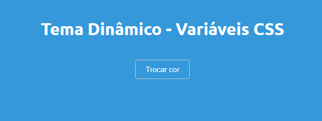

# Variáveis CSS: Design Dinâmico e Personalizável

As variáveis CSS permitem que desenvolvedores definam valores reutilizáveis nas folhas de estilo e os modifiquem dinamicamente, criando designs flexíveis e fáceis de manter. A seguir, vamos explorar o conceito e aplicação de variáveis CSS com um exemplo prático.

## O que são Variáveis CSS?

Variáveis CSS são propriedades que podem armazenar valores, como cores, tamanhos e fontes, para serem reutilizados em qualquer parte do CSS. Elas são declaradas com dois hífens (`--`) e, normalmente, definidas na pseudoclasse `:root` para estarem disponíveis globalmente.

**Exemplo:**

```css
:root {
  --primary-color: #3498db;
}
```

Neste exemplo, a variável `--primary-color` armazena o valor `#3498db`, que pode ser aplicado em qualquer lugar no CSS.

## Como Usar Variáveis CSS?

Depois de definidas, as variáveis podem ser usadas em qualquer parte do CSS através da função `var()`.

**Exemplo:**

```css
body {
  background-color: var(--primary-color);
}
```

Neste caso, a cor de fundo da página será definida pela variável `--primary-color`.

## Exemplo Prático: Cores Dinâmicas

Neste exemplo, o usuário pode alterar dinamicamente a cor de fundo da página e do botão ao clicar em um botão, gerando uma cor aleatória.

### HTML

```html
<!DOCTYPE html>
<html lang="pt-BR">
<head>
  <meta charset="UTF-8">
  <meta name="viewport" content="width=device-width, initial-scale=1.0">
  <title>CSS Variables</title>
  <link rel="stylesheet" href="styles.css">
</head>
<body>

  <h1>Tema Dinâmico - Variáveis CSS</h1>
  <button id="changeColorBtn">Trocar cor</button>

  <script src="script.js"></script>
</body>
</html>
```

### CSS

```css
@import url('https://fonts.googleapis.com/css2?family=Ubuntu:ital,wght@0,300;0,400;0,500;0,700;1,300;1,400;1,500;1,700&display=swap');

:root {
  --primary-color: #3498db;
}

body {
  background-color: var(--primary-color);
  color: #ddd0d0;
  padding: 20px;
  text-align: center;
  font-family: "Ubuntu", sans-serif;
}

button {
  background-color: var(--primary-color);
  color: #ddd0d0;
  border: none;
  padding: 10px 20px;
  cursor: pointer;
  margin: 20px;
  border-radius: 5px;
  border: 1px solid #cacaca;
}
```

### JavaScript

```javascript
document.getElementById('changeColorBtn').addEventListener('click', function() {
  var randomColor = '#' + Math.floor(Math.random() * 16777215).toString(16);
  document.documentElement.style.setProperty('--primary-color', randomColor);
});
```

### Explicação do Código

- **HTML**: Define a estrutura básica da página com um botão para trocar a cor.
- **CSS**: Define a aparência da página, usando variáveis CSS para definir a cor de fundo e a aparência do botão. Inclui a importação da fonte "Ubuntu" do Google Fonts.
- **JavaScript**: Adiciona um evento de clique ao botão, gerando uma cor hexadecimal aleatória e aplicando-a à variável CSS `--primary-color`, o que atualiza a cor de fundo e do botão dinamicamente.

## Vantagens das Variáveis CSS

- **Reutilização e Modificação**: Você define uma variável uma vez e a utiliza em várias partes do CSS, facilitando a manutenção.
- **Estilo Dinâmico**: As variáveis podem ser alteradas via JavaScript, permitindo a criação de temas interativos.
- **Escopo Flexível**: Podem ser aplicadas globalmente ou localmente em elementos específicos.
- **Compatibilidade**: Compatível com a maioria dos navegadores modernos.

## Conclusão

O uso de variáveis CSS é uma maneira eficiente de criar designs dinâmicos e manter o código CSS limpo e de fácil manutenção. Esse exemplo mostra como você pode usar variáveis CSS para criar uma interface interativa, onde as cores podem ser modificadas em tempo real.

